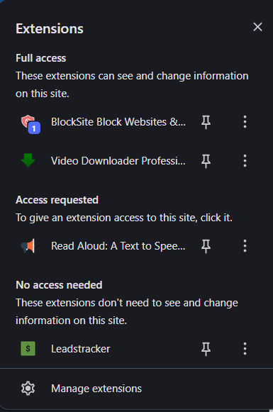
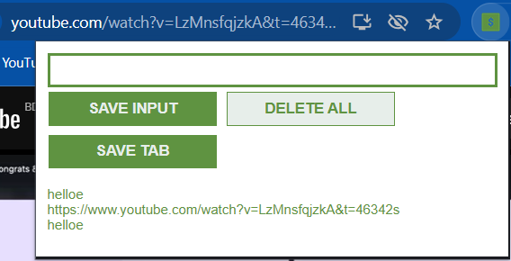

# Leadstracker Chrome Extension

## Overview
Leadstracker is a simple Chrome extension that allows users to save and manage leads (URLs) from their browsing session. It demonstrates various JavaScript concepts including event listeners, DOM manipulation, local storage, and JSON handling.

## Features
- Save custom input leads
- Save current tab URL
- Delete all saved leads
- Persistent storage using localStorage

## Usage
1. Click on the extension icon in your Chrome toolbar
2. Enter a URL in the input field and click "SAVE INPUT"
3. Click "SAVE TAB" to save the current tab's URL
4. Double-click "DELETE ALL" to clear all saved leads
5. Click on any saved lead to open it in a new tab

## Screenshots

## Learned Concepts Applied
This project incorporates the following JavaScript concepts:

- **const**: Used for declaring constants like DOM element references 
- **addEventListener()**: Attaches event listeners to buttons for user interactions 
- **innerHTML**: Dynamically updates the DOM content 
- **input.value**: Retrieves user input from form elements 
- **Function Parameters**: Functions accept parameters for flexibility 
- **Template Strings**: Uses backticks for string interpolation 
- **localStorage**: Persists data across browser sessions 
- **The JSON Object**: Converts objects to strings and vice versa for storage 
- **Objects in Arrays**: Stores leads as strings in an array 