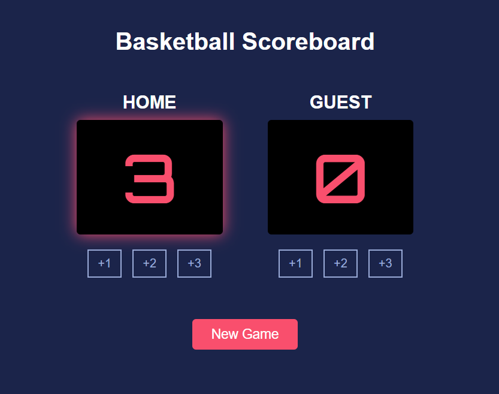

# Basketball Scoreboard

## Overview
This is a simple web-based basketball scoreboard application built with HTML, CSS, and JavaScript. The app allows users to track scores for home and guest teams, with options to add points and start new games.

## Features
- Add 1, 2, or 3 points to either the home or guest team
- Highlight the leading team automatically
- Start a new game to reset scores
- Simple and clean user interface

## How to Use
1. Open `index.html` in a web browser
2. Click the +1, +2, or +3 buttons under each team to add points
3. The leading team's score will be highlighted
4. Click "New Game" to reset all scores

## Screenshots

## Technologies Used
- **HTML**: Structure of the scoreboard
- **CSS**: Styling for the interface and highlighting
- **JavaScript**: Logic for score updates, leader highlighting, and new game functionality
